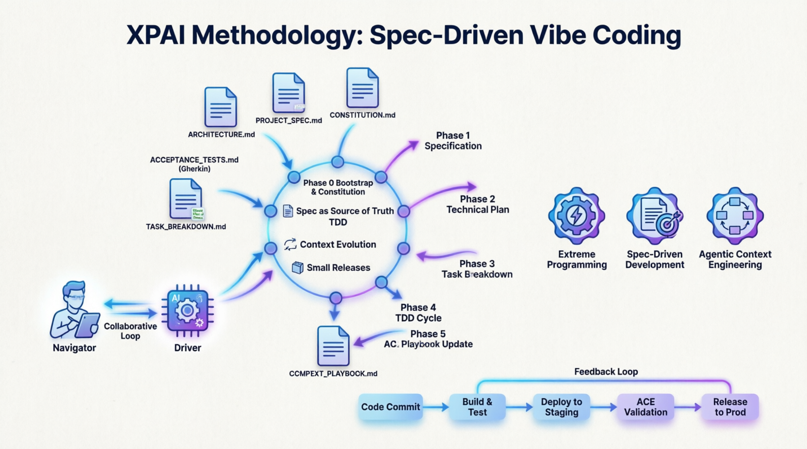

# XPAI — Spec-Driven Vibe Coding

**eXtreme Prompt-Aided Implementation** · v2.2 · Abril 2026

> *"O LLM não conhece seu domínio. Você conhece. O resultado é proporcional ao que você traz para a conversa."*

---



---

## Autor

**Francisco Fabian de Macedo Almeida**
Arquiteto de Software · Engenheiro de Software

[](https://www.linkedin.com/in/francisco-fabian-macedo-almeida-8911578b/)

Programador desde 2001, com experiência em sistemas regulatórios, arquitetura orientada a eventos e desenvolvimento assistido por IA. A XPAI foi desenvolvida a partir de prática real — não de teoria — durante a construção do sistema DT-e/CIOT em 2026.

---

## O que é a XPAI

XPAI é uma metodologia de desenvolvimento de software assistido por IA para equipes e engenheiros que trabalham em domínios com **regras de negócio críticas, conformidade legal ou invariantes que não podem ser violadas**.

Não é vibe coding. É **spec-driven vibe coding**: você especifica com precisão, o agente implementa com velocidade.

A premissa central:

```
HUMANO: decide O QUÊ e O PORQUÊ
AGENTE: decide O COMO (implementação)

Você é o Navigator — o agente é o Driver.
Inverta isso e o resultado piora dramaticamente, sempre.
```

---

## A Metodologia

📄 **[XPAI-v2.2.md](./XPAI-v2.2.md)** — Documentação completa da metodologia v2.2

Inclui:
- Os 10 princípios operacionais
- As 6 fases de implementação (F0 a F6)
- Os artefatos obrigatórios com templates prontos
- Checklists operacionais (início de sessão, por tarefa, antes do deploy)
- Protocolo de handoff entre agentes
- Distinção entre regressão acidental e evolução de contrato

---

## Por que existe

Em 2026, construí a fundação de um sistema regulatório complexo (DT-e/CIOT, MP 1.343/2026) em **2 dias, sem escrever uma linha de código**:

- 67 arquivos gerados e testados
- 26 use cases em Gherkin com cobertura de CI
- Cada decisão arquitetural com referência ao artigo de lei correspondente
- Descoberta de um GAP técnico que parecia exigir meses de negociação — e não existia

A XPAI foi a metodologia que tornou isso possível. Este repositório é a documentação pública para que outros possam usá-la.

---

## Os 10 Princípios em 30 Segundos

| # | Princípio | Núcleo |
|---|-----------|--------|
| 1 | Spec como fonte da verdade | Código deriva da spec — nunca o contrário |
| 2 | Pair programming humano-agente | Humano navega, agente pilota |
| 3 | TDD é mais importante com IA | Agente não tem medo de subir código quebrado. Você deveria ter |
| 4 | Contexto evolutivo (ACE) | Playbook dinâmico — delta updates, nunca rewrite |
| 5 | Small releases + CI/CD | Cada commit é production-ready, sem exceção |
| 6 | Refactoring contínuo | O agente empilha rápido. Alguém precisa podar |
| 7 | Human-in-the-loop | Responsabilidade legal não é delegável ao modelo |
| 8 | O domínio como especificação formal | Legislação e regras de negócio são specs executáveis |
| 9 | Proibição explícita supera instrução positiva | "NUNCA X porque Y causa Z" é mais eficaz que "use X" |
| 10 | Resultado proporcional ao contexto | Sênior com XPAI ≠ júnior com XPAI |

---

## As 6 Fases

```
F0  Bootstrap & Constitution    — regras invioláveis antes de qualquer código     (1–2h)
F1  Specification               — use cases em Gherkin, o "o quê" sem o "como"   (2–4h)
F2  Technical Plan              — arquitetura com justificativa por decisão        (1–2h)
F3  Task Breakdown              — tasks INVEST com prompt e contexto calibrado     (1h)
F4  TDD Cycle                   — testes antes da implementação, CI obrigatório    (30–60min/task)
F5  Refactoring & Hardening     — poda periódica, safety net de testes             (a cada 5–10 commits)
F6  ACE Playbook Update         — memória explícita acumulada entre sessões         (por sessão)
```

---

## Os Artefatos

Cada projeto XPAI tem estes arquivos na raiz:

| Arquivo | Função | Frequência |
|---------|--------|------------|
| `CONSTITUTION.md` | Regras invioláveis — lido em toda sessão | Raramente |
| `PROJECT_SPEC.md` | Problem statement + acceptance criteria em Gherkin | Por feature |
| `ACCEPTANCE_TESTS.md` | Use cases executáveis — viram testes de integração | Por feature |
| `ARCHITECTURE.md` | Decisões técnicas com justificativa | Por decisão |
| `TASK_BREAKDOWN.md` | Tasks com prompt pronto e contexto calibrado | Por feature |
| `CONTEXT_PLAYBOOK.md` | Playbook evolutivo — delta updates, nunca rewrite | Por hurdle |
| `WALKTHROUGH.md` | Histórico de execução por task — viaja com o git | Por task |
| `SECURITY_CHECKLIST.md` | Gates de segurança por feature | Por feature |

Templates prontos para uso em [`/templates`](./templates/).

---

## Como Usar

A XPAI parte de uma premissa: **você já sabe o que o sistema deve fazer** — inclusive o que ele não pode fazer sob nenhuma circunstância. O agente implementa. Você especifica.

O ponto de entrada não é o código. É o domínio.

---

### Passo 1 — Reúna o conhecimento do domínio

Antes de abrir o editor ou o chat do LLM, responda por escrito:

- **O que o sistema faz?** Em uma frase com verbo e sujeito mensuráveis.
- **O que o sistema nunca pode fazer?** Liste as invariantes — comportamentos cuja violação tem consequência real (multa, fraude, dado incorreto, falha de segurança).
- **Qual a base normativa?** Se houver legislação, regulamento, política interna ou contrato que rege o sistema — reúna os documentos. A lei é uma especificação formal; você vai usá-la diretamente.

> **Exemplo:** "O sistema gera CIOTs para operações de transporte de cargas. Nunca pode gerar um CIOT com valor de frete abaixo do piso mínimo legal (Art. 1º-B Res. 6.078/2026). Base: MP 1.343/2026, Res. ANTT 6.077/2026, Decreto 11.313/2022."

Se você não consegue responder essas três perguntas com precisão, a XPAI vai amplificar a ambiguidade — não resolvê-la. Volte para o domínio antes de continuar.

---

### Passo 2 — Gere a estrutura de artefatos com o agente

Com o conhecimento de domínio em mãos, abra o agente e use este prompt:

```
Vou usar a metodologia XPAI v2.2 (Spec-Driven Vibe Coding) para desenvolver
o seguinte sistema:

[DESCREVA O SISTEMA em 2-5 parágrafos: o que faz, quem usa, qual o problema que resolve]

Regras invioláveis do domínio:
- [regra 1 — com consequência explícita se violada]
- [regra 2]
- [regra 3]

Base normativa (se houver):
- [documento 1]
- [documento 2]

Stack tecnológico definido:
- [linguagem, framework, banco, CI]

Com base nisso, gere os seguintes artefatos iniciais da metodologia XPAI:
1. CONSTITUTION.md — com as regras invioláveis, stack, Non-Delegation Zones e limites de complexidade
2. PROJECT_SPEC.md — com problem statement, goals, non-goals e primeiros use cases em Gherkin
3. CONTEXT_PLAYBOOK.md — estrutura inicial com o overview do projeto
4. WALKTHROUGH.md — estrutura vazia pronta para uso

Não gere código. Apenas os artefatos de especificação.
```

> O agente vai produzir a estrutura. Você vai revisar e corrigir — especialmente a CONSTITUTION.md, que define o que o agente nunca pode fazer. Essa revisão é obrigatória e é o trabalho mais importante do projeto.

---

### Passo 3 — Revise a CONSTITUTION.md (gate humano obrigatório)

Abra o arquivo gerado e verifique:

- [ ] As regras invioláveis estão com a **razão concreta** explicitada?
  - ❌ "Use BigDecimal para valores monetários"
  - ✅ "NUNCA use float para valorFrete — float(1306.14) pode ser 1306.1399999... e bloquear um frete legal com multa de R$ 10.500 por operação"
- [ ] As **Non-Delegation Zones** cobrem segurança, lógica crítica e infraestrutura?
- [ ] O **stack tecnológico** está fixado e não deixa margem para o agente escolher alternativas?
- [ ] Os **limites de complexidade** estão definidos (LOC por arquivo, parâmetros por função)?

Só avance depois de validar. A CONSTITUTION.md é lida pelo agente em toda sessão — o que não estiver aqui, o agente vai inventar.

---

### Passo 4 — Execute as 6 fases

#### F0 — Bootstrap & Constitution *(1–2h · gate humano obrigatório)*

Já feito nos passos anteriores. Antes de avançar, confirme:

- CONSTITUTION.md commitada e revisada por humano
- Stack tecnológico fixado e sem ambiguidade
- Non-Delegation Zones definidas
- Regras invioláveis com razão concreta explicitada

Nenhuma task de implementação começa sem a F0 concluída.

---

#### F1 — Specification *(2–4h)*

Expanda o PROJECT_SPEC.md com todos os use cases em Gherkin. Cada cenário descreve um comportamento observável do sistema — não uma decisão de implementação.

**Prompt para o agente:**
```
Leia CONSTITUTION.md e PROJECT_SPEC.md.

Com base no domínio descrito, expanda o ACCEPTANCE_TESTS.md com use cases
completos em Gherkin cobrindo:
- Caminho feliz (operação válida do início ao fim)
- Rejeições por regra de negócio (cada invariante da CONSTITUTION.md deve ter ao menos um cenário de rejeição)
- Casos de borda (valores exatos no limite, campos ausentes, estados intermediários)
- Falhas de infraestrutura (serviço externo indisponível, timeout, retry)

Para cada cenário, inclua o campo `referenciaLegal` no Then quando a regra
tiver âncora normativa.

Não gere código. Apenas os cenários Gherkin.
```

> Os acceptance tests gerados aqui são a especificação executável do sistema. Eles viram testes de integração na F4 — e **nunca são alterados para "fazer o CI passar"**. Se um acceptance test quebra, a implementação está errada.

---

#### F2 — Technical Plan *(1–2h)*

Gere o ARCHITECTURE.md. Cada decisão arquitetural deve ter uma justificativa — técnica, legal ou de domínio. Sem justificativa, é preferência; com justificativa, é restrição.

**Prompt para o agente:**
```
Leia CONSTITUTION.md, PROJECT_SPEC.md e ACCEPTANCE_TESTS.md.

Gere o ARCHITECTURE.md com:

1. Padrão arquitetural escolhido e justificativa
   (ex: Event Sourcing porque imutabilidade de evidências é requisito legal — Art. X)

2. Diagrama de componentes em texto (ASCII ou Mermaid)
   — todos os serviços, seus papéis e como se comunicam

3. Fluxo crítico passo a passo
   — a operação principal do sistema, da entrada ao retorno, com cada validação numerada

4. Decisões técnicas com justificativa
   — para cada padrão usado (CQRS, Saga, ABAC, etc.): por que existe, qual requisito atende

5. SLAs técnicos derivados do domínio
   — latência, disponibilidade, retenção de dados — com a origem de cada requisito

6. Constraints explícitos
   — o que o sistema nunca faz do ponto de vista arquitetural

Não gere código. Apenas o documento de arquitetura.
```

> Revise especialmente o fluxo crítico. A ordem das validações importa — em sistemas regulatórios, validar o campo errado na sequência errada pode gerar consequências legais. Se o sistema tem uma sequência obrigatória definida em lei, ela deve aparecer explicitamente aqui.

---

#### F3 — Task Breakdown *(1h)*

Decomponha o sistema em tarefas atômicas executáveis pelo agente, no critério INVEST.

**Prompt para o agente:**
```
Leia CONSTITUTION.md, ARCHITECTURE.md e ACCEPTANCE_TESTS.md.

Gere o TASK_BREAKDOWN.md decompondo a implementação em tasks INVEST:
[I]ndependent — executável sem depender de task não concluída
[N]egotiable — escopo ajustável sem quebrar o todo
[V]aluable — entrega valor verificável por si só
[E]stimable — entre 1h e 8h de trabalho do agente
[S]mall — cabe em uma janela de contexto
[T]estable — tem critério de aceitação verificável

Para cada task, inclua:
- Critérios INVEST preenchidos
- Prompt pronto para colar no agente (com lista de arquivos de contexto específicos)
- Estrutura de arquivos a criar (caminhos exatos, incluindo testes)
- Entregável verificável
- Flag [REVISÃO HUMANA OBRIGATÓRIA] se tocar em Non-Delegation Zone

Comece pelas tasks de infraestrutura e fundação, depois domínio, depois integrações.
```

> Tasks que tocam em Non-Delegation Zones (segurança, lógica crítica, infraestrutura de produção) devem ter revisão humana obrigatória antes do merge — independentemente de o CI estar verde.

---

#### F4 — TDD Cycle *(30–60min por task)*

Para cada task do TASK_BREAKDOWN.md, execute o ciclo:

```
1. Abrir nova sessão no agente
2. Colar os arquivos de contexto listados na task
   (sempre: CONSTITUTION.md + CONTEXT_PLAYBOOK.md + WALKTHROUGH.md)
3. Colar o prompt da task
4. Revisar o plano proposto pelo agente ANTES de pedir implementação
5. Agente gera testes → agente gera implementação
6. CI roda — testes passam
7. Revisar diff antes de commitar
8. Atualizar WALKTHROUGH.md e CONTEXT_PLAYBOOK.md
```

**Atenção à distinção entre tipos de quebra de teste:**

| Tipo | Causa | Protocolo |
|------|-------|-----------|
| Regressão acidental | Bug na nova implementação | Corrigir o código. Nunca alterar o teste. |
| Evolução de contrato | Mudança estrutural intencional | Atualizar o teste. Revisão humana obrigatória. Documentar no WALKTHROUGH.md. |

Acceptance tests **nunca** são evolução de contrato. Se quebram, o código está errado.

---

#### F5 — Refactoring & Hardening *(a cada 5–10 commits)*

```
Leia CONSTITUTION.md e CONTEXT_PLAYBOOK.md.

Analise os últimos [N] commits e identifique:
- Arquivos com mais de 200 LOC
- Duplicação de lógica (3x ou mais)
- Complexidade ciclomática acima de 10
- Abstrações prematuras ou ausentes

Proponha um plano de refactoring que mantenha todos os testes verdes.
Não implemente ainda — apresente o plano para aprovação.
```

---

#### F6 — ACE Playbook Update *(ao finalizar cada task)*

Ao finalizar cada task, o agente deve executar duas atualizações:

**WALKTHROUGH.md** — histórico detalhado da task:
- O que foi implementado e decisões técnicas tomadas
- Bugs encontrados e como foram resolvidos
- Desvios do plano original
- Status do build
- Pendências para a próxima sessão

**CONTEXT_PLAYBOOK.md** — apenas padrões recorrentes promovidos do walkthrough:
- `[ts-xxxxx]` para bugs que outro agente provavelmente repetiria
- `[shr-xxxxx]` para decisões que devem virar regra permanente
- `[dk-xxxxx]` para conhecimento de domínio descoberto
- `[hurdle-xxx]` para problemas em aberto

> Não promova bugs de ambiente local. Só o que vale para qualquer agente, em qualquer sessão futura.

---

### Regra de ouro para toda sessão com o agente

Sempre comece a sessão colando estes arquivos **antes** do prompt da task:

```
Arquivos obrigatórios em toda sessão:
- CONSTITUTION.md
- CONTEXT_PLAYBOOK.md
- WALKTHROUGH.md

Arquivos por tipo de task:
- ACCEPTANCE_TESTS.md  → tasks com lógica de negócio observável
- ARCHITECTURE.md      → tasks estruturais
- SECURITY_CHECKLIST.md → tasks com superfície de segurança
```

Sem o contexto injetado, o agente começa do zero — e vai repetir erros que você já resolveu.

---

### Copiando os templates

```bash
git clone https://github.com/fabianalmeida/xpai.git

cp xpai/templates/CONSTITUTION.md      meu-projeto/
cp xpai/templates/CONTEXT_PLAYBOOK.md  meu-projeto/
cp xpai/templates/WALKTHROUGH.md       meu-projeto/
cp xpai/templates/SECURITY_CHECKLIST.md meu-projeto/
```

---

## Para Quem É

✅ Engenheiros e arquitetos sêniors desenvolvendo em domínios com **regras críticas ou conformidade legal**

✅ Times que precisam de **rastreabilidade** entre requisito de negócio e implementação

✅ Projetos onde um erro tem **consequência mensurável** — financeira, legal ou operacional

✅ Qualquer desenvolvedor que quer usar IA **sem perder o controle** do que está sendo construído

## O Que Não É

❌ Uma receita para substituir engenheiros por LLMs

❌ Uma solução para quem não tem conhecimento de domínio

❌ Agnóstica ao esforço — a spec é o produto principal e exige experiência para ser escrita bem

---

## Caso de Uso de Referência

A metodologia foi desenvolvida e validada no projeto **DT-e/CIOT** — sistema de conformidade regulatória do transporte rodoviário de cargas brasileiro (MP 1.343/2026).

Mais detalhes: [`/examples/dte-ciot`](./examples/dte-ciot/)

---

## Estrutura do Repositório

```
xpai/
├── README.md                    ← este arquivo
├── XPAI-v2.2.md                 ← documentação completa da metodologia
├── CHANGELOG.md                 ← histórico de versões
├── CONTRIBUTING.md              ← como contribuir
├── LICENSE                      ← MIT
│
├── templates/                   ← templates prontos para uso
│   ├── CONSTITUTION.md
│   ├── CONTEXT_PLAYBOOK.md
│   ├── WALKTHROUGH.md
│   └── SECURITY_CHECKLIST.md
│
├── docs/                        ← documentação complementar
│   ├── principios.md            ← aprofundamento dos 10 princípios
│   ├── faq.md                   ← perguntas frequentes
│   └── handoff-entre-agentes.md ← protocolo de troca de agente/modelo
│
└── examples/                    ← projetos de referência
    └── dte-ciot/
        └── README.md            ← resumo do caso DT-e/CIOT
```

---

## Histórico de Versões

| Versão | Data | Principais mudanças |
|--------|------|---------------------|
| 2.2.2 | Abr 2026 | Seção 5.3.1 — distinção regressão acidental vs evolução de contrato |
| 2.2.1 | Abr 2026 | WALKTHROUGH.md, contexto calibrado por task (3.4), estrutura explícita (3.5), P8/P9/P10 |
| 2.2   | Mar 2026 | Versão inicial publicada |

Histórico completo: [CHANGELOG.md](./CHANGELOG.md)

---

## Licença

MIT — use, adapte, contribua. Ver [LICENSE](./LICENSE).

---

*Construído a partir de prática real, não de teoria. Cada princípio foi adicionado porque, sem ele, algo quebrou de um jeito que custou tempo ou dinheiro.*
