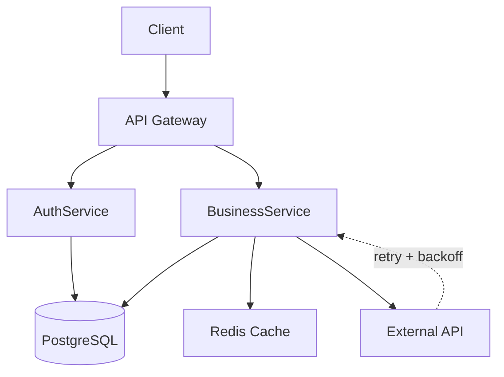

# Documentação Metodológica Oficial: XPAI (Spec-Driven Vibe Coding)

**Versão:** 2.2.2 — Revisada e Consolidada  
**Status:** Definitivo  
**Base:** Extreme Programming + Spec-Driven Development + Agentic Context Engineering  
**Ambiente Alvo:** IDE Antigravity e Ecossistemas AI-Native  
**Última Revisão:** Abril 2026 (v2.2.2)

---

## 1. Fundamentos e Diretrizes

Esta seção estabelece os princípios inegociáveis que regem o desenvolvimento de software assistido por IA. O código é um ativo legível por humanos e máquinas (LLMs).

### 1.1. Lei de Ouro da Metodologia

```
┌─────────────────────────────────────────────────────────┐
│ HUMANO: decide O QUÊ e O PORQUÊ                         │
│ AGENTE: decide O COMO (implementação)                   │
│                                                         │
│ Você é o Navigator — o agente é o Driver                │
│ Inverta isso e o resultado piora dramaticamente, sempre │
└─────────────────────────────────────────────────────────┘
```

### 1.2. As Três Correntes Fundadoras

| Corrente | Origem | Contribuição Central para XPAI |
|----------|--------|-------------------------------|
| **Extreme Programming (XP)** | Kent Beck, 1999 | Pair programming, TDD, small releases, CI, refactoring contínuo |
| **Spec-Driven Development (SDD)** | GitHub Spec-Kit, 2025 | Constitution + Spec + Plan + Tasks como artefatos vivos antes do código |
| **Agentic Context Engineering (ACE)** | Stanford/SambaNova, ICLR 2026 | Playbook evolutivo com delta updates, Reflector/Curator, prevenção de context collapse |

### 1.3. Os 7 Princípios Operacionais XPAI

| # | Princípio | Descrição |
|---|-----------|-----------|
| **1** | **Spec como Fonte da Verdade** | Code deriva da spec, não o contrário. Specs evoluem com o projeto (não são waterfall) |
| **2** | **Pair Programming Humano-Agente** | Humano navega (quê/porquê), Agente pilota (como). Interrupção ativa quando o agente sobre-engenheira |
| **3** | **TDD é Mais Importante com IA** | Agente escreve testes ANTES da implementação. Ratio teste/código ≥ 1.5x (alvo) |
| **4** | **Contexto Evolutivo (ACE)** | Playbook dinâmico que acumula estratégias. Delta updates incrementais (NUNCA rewrites) |
| **5** | **Small Releases + CI/CD** | Cada commit é production-ready. Pipeline: lint → security → tests → deploy |
| **6** | **Refactoring Contínuo** | Agente empilha código → humano poda. Refactors pequenos e frequentes (< 5 min) |
| **7** | **Human-in-the-Loop para Non-Delegation Zones** | Segurança, arquitetura, regras de domínio e infraestrutura exigem revisão humana obrigatória |
| **8** | **A Lei (ou Domínio) como Especificação Formal** | Em domínios regulados, a legislação já é uma especificação. Cada decisão técnica deve ter âncora no documento normativo (artigo, inciso, resolução). Inspirado no OpenFisca: tradução fiel, não interpretação criativa |
| **9** | **Proibição Explícita supera Instrução Positiva** | "NUNCA use float — float(1306.14) pode ser 1306.1399999 e causar multa de R$ 10.500" é mais eficaz que "use BigDecimal". A razão concreta da proibição é parte da regra |
| **10** | **Resultado proporcional ao contexto fornecido** | A diferença entre um dev júnior e um arquiteto sênior usando IA não é a ferramenta — é a profundidade e precisão do contexto que cada um constrói |

### 1.4. Princípios de Design Técnicos

- **Modularidade Atômica:** Cada função ou classe deve ter uma única responsabilidade clara
- **Isolamento Multi-Tenant:** `project_id` em TODAS as queries, nunca confiar no frontend
- **Background Processing:** Operações > 2 segundos devem ser assíncronas
- **APIs Externas:** Sempre mockadas nos testes unitários (VCR cassettes para integração)
- **Segurança por Design:** Validação de entrada em todas as camadas. Secrets via env vars, NUNCA hard-coded
- **RAG-Ready:** Estrutura de dados e documentação otimizada para indexação vetorial futura

---

## 2. Padrão Arquitetural

A arquitetura segue um modelo em camadas, containerizado, garantindo portabilidade e escalabilidade.

### 2.1. Stack Tecnológico (Agnóstico com Exemplos)

| Componente | Opções Recomendadas | Observações |
|------------|--------------------|-------------|
| **Framework** | FastAPI / Rails / Next.js / Spring Boot | Definir no CONSTITUTION.md |
| **Linguagem** | Python / Ruby / TypeScript / Java | Escolher baseado no domínio |
| **Database** | PostgreSQL / SQLite / MySQL | Com suporte a pgvector se necessário para RAG |
| **Cache** | Redis / Memcached | Para sessões e dados frequentes |
| **Deploy** | Kamal / Railway / Vercel / Kubernetes | Health checks obrigatórios |
| **CI** | GitHub Actions / GitLab CI | lint → audit → security → tests |
| **Testing** | pytest / Minitest / Jest / JUnit | Coverage mínima: ≥80% line, ≥70% branch |

### 2.2. Padrão de Comunicação entre Componentes

```
┌─────────────────────────────────────────────────────────┐
│                    ARCHITECTURE PATTERN                 │
│                                                         │
│  Jobs Orquestram → Services Executam → Models Persistem │
│                                                         │
│  Exemplo: NewsletterAssemblyJob                         │
│         ↓                                               │
│  EmailService                                           │
│         ↓                                               │
│  SesMailer → AWS SES                                    │
│                                                         │
│  External APIs: Sempre com retry + backoff + circuit    │
│  breaker. Timeout configurado (< 10s)                   │
└─────────────────────────────────────────────────────────┘
```

### 2.3. Constraints Arquiteturais Explícitas

| Constraint | Limite | Ação ao Ultrapassar |
|------------|--------|--------------------|
| **LOC por Arquivo** | Máx. 200 | Refatorar imediatamente |
| **Parâmetros por Função** | Máx. 5 | Extrair objeto/struct |
| **Níveis de Indentação** | Máx. 3 | Refatorar lógica |
| **Complexidade Ciclomática** | Máx. 10 | Dividir função |
| **Tempo de CI** | Máx. 60s | Adicionar paralelismo |

### 2.4. Diagramas Obrigatórios (Mermaid)

Todos os fluxos críticos devem ser documentados em diagramas Mermaid no `ARCHITECTURE.md`:



---

## 3. Estrutura de Arquivos (IDE Antigravity)

A estrutura abaixo é otimizada para o ambiente **Antigravity IDE**, aproveitando seus recursos de indexação de contexto e perfis de agentes.

### 3.1. Árvore de Diretórios Padrão

```text
project-root/
├── CONSTITUTION.md              # Princípios não-negociáveis (raramente muda)
├── PROJECT_SPEC.md              # Especificação viva (evolui por feature)
├── ARCHITECTURE.md              # Constraints arquiteturais explícitas
├── ACCEPTANCE_TESTS.md          # Critérios em Gherkin/BDD executável
├── CONTEXT_PLAYBOOK.md          # Playbook evolutivo (ACE)
├── TASK_BREAKDOWN.md            # Decomposição atômica com critérios INVEST
├── WALKTHROUGH.md               # Histórico de execução de tasks (novo — v2.2.1)
├── SECURITY_CHECKLIST.md        # SSRF, CSP, rate limiting, encryption
├── README.md                    # Visão geral e guia de início rápido
├── .antigravity/
│   ├── agent-config.yaml        # Configuração do agente no IDE
│   ├── prompt-templates/        # Templates: specify/plan/generate/validate
│   ├── context-cache/           # Cache de contexto para eficiência
│   └── context_rules.md         # Regras de contexto para RAG local
├── .github/
│   └── workflows/
│       └── ci.yml               # Pipeline CI/CD
├── src/
│   ├── __init__.py
│   ├── core/                    # Lógica de negócio pura
│   ├── agents/                  # Definições de agentes autônomos
│   ├── data/                    # Pipelines de ETL, modelos de dados
│   ├── infrastructure/          # Configs de DB, Docker, Cloud
│   ├── api/                     # Endpoints e controllers
│   └── tests/                   # Suíte de testes (unit, integration, acceptance)
├── docs/                        # Documentação técnica e diagramas Mermaid
├── scripts/                     # Scripts de utilidade e setup
├── .env.example                 # Modelo de variáveis de ambiente
├── .gitignore
├── Dockerfile
├── docker-compose.yml
└── requirements.txt / package.json / Gemfile
```

### 3.2. Detalhamento da Pasta `.antigravity/`

| Arquivo | Propósito | Frequência de Update |
|---------|-----------|---------------------|
| `agent-config.yaml` | Define provider, model, context-window, temperature | Setup inicial |
| `prompt-templates/` | Templates para specify, plan, generate, validate | Evolutivo |
| `context-cache/` | Cache de contexto para eficiência do RAG local | Automático |
| `context_rules.md` | Instruções explícitas sobre padrões e convenções | Evolutivo |

### 3.3. Artefatos Obrigatórios e Suas Finalidades

| Artefato | Finalidade | Quando Atualizar |
|----------|------------|-----------------|
| **CONSTITUTION.md** | Princípios não-negociáveis (stack, segurança, limites) | Raramente (gate formal) |
| **PROJECT_SPEC.md** | Problem statement, goals, user stories, acceptance criteria | Por feature |
| **CONTEXT_PLAYBOOK.md** | Playbook evolutivo com delta updates e IDs únicos | Após cada hurdle/sessão |
| **TASK_BREAKDOWN.md** | Decomposição em tarefas atômicas INVEST-compliant | Por feature |
| **SECURITY_CHECKLIST.md** | Checklist de segurança por feature | Por feature + auditoria mensal |
| **WALKTHROUGH.md** | Histórico detalhado de execução por task: decisões técnicas, bugs, desvios, status do build, pendências. Viaja com o repositório — não fica preso no IDE | Ao finalizar cada task |


### 3.4. Contexto Calibrado por Task (novo — v2.2.1)

Não se cola todos os artefatos em toda sessão. Cada task especifica exatamente quais arquivos incluir no contexto — minimizando ruído e maximizando foco do agente.

| Arquivo | Quando incluir |
|---------|---------------|
| `CONTEXT.md` / contexto fixo | **Sempre** — regras invioláveis do projeto |
| `CONSTITUTION.md` | **Sempre** — princípios não-negociáveis |
| `CONTEXT_PLAYBOOK.md` | **Sempre** — hurdles e padrões acumulados |
| `ACCEPTANCE_TESTS.md` | Tasks com lógica de negócio observável externamente |
| `ARCHITECTURE.md` | Tasks estruturais: infra, event store, sagas, CI |
| `SECURITY_CHECKLIST.md` | Tasks com superfície de segurança |
| `PROJECT_SPEC.md` | Tasks com user stories ou regras de domínio |

> **Regra prática:** incluir ACCEPTANCE_TESTS.md apenas quando o agente precisar saber *o que o sistema aceita ou recusa como comportamento externo*. Não incluir em tasks de Value Objects, infraestrutura ou mocks isolados.

### 3.5. Estrutura de Arquivos Explícita em Cada Prompt (novo — v2.2.1)

Todo prompt de task deve conter um bloco `Estrutura de arquivos a criar` com os caminhos exatos de todos os artefatos gerados — incluindo os de teste. Sem isso, o agente cria arquivos em locais arbitrários (ex: `/tmp`).

**Convenção Java:**
```
src/main/java/.../{pacote}/  ← implementação
src/test/java/.../{pacote}/unit/         ← testes unitários
src/test/java/.../{pacote}/integration/  ← testes de integração
```

**Convenção Python (mocks e scripts):**
```
mocks/{nome-do-mock}/main.py         ← implementação
mocks/{nome-do-mock}/test_main.py    ← testes pytest (mesma pasta)
```

---

## 4. Fluxo de Implementação

O ciclo de desenvolvimento segue um fluxo iterativo e validado em **7 Fases**, minimizando alucinações e erros de lógica.

### 4.1. Visão Geral das 7 Fases

```
┌──────────────────────────────────────┐
│  FASE 0: Bootstrap & Constitution    │
│  Output: CONSTITUTION.md + estrutura │
│  Duração: 1-2h                       │
└────────────┬─────────────────────────┘
             ▼
┌──────────────────────────────────────┐
│  FASE 1: Specification               │
│  Output: PROJECT_SPEC.md com Gherkin │
│  Duração: 2-4h                       │
└────────────┬─────────────────────────┘
             ▼
┌──────────────────────────────────────┐
│  FASE 2: Technical Plan              │
│  Output: ARCHITECTURE.md + Gates     │
│  Duração: 1-2h                       │
└────────────┬─────────────────────────┘
             ▼
┌──────────────────────────────────────┐
│  FASE 3: Task Breakdown              │
│  Output: TASKS/ com checklist INVEST │
│  Duração: 1h                         │
└────────────┬─────────────────────────┘
             ▼
┌──────────────────────────────────────┐
│  FASE 4: TDD Cycle (por tarefa)      │
│  Output: Código testado + CI verde   │
│  Duração: 30-60min/tarefa            │
└────────────┬─────────────────────────┘
             ▼
┌──────────────────────────────────────┐
│  FASE 5: Refactoring & Hardening     │
│  Output: Código saudável, zero dívida│
│  Trigger: a cada 5-10 commits        │
└────────────┬─────────────────────────┘
             ▼
┌──────────────────────────────────────┐
│  FASE 6: ACE Playbook Update         │
│  Output: CONTEXT_PLAYBOOK.md atualizado│
│  Trigger: após cada hurdle/sessão   │
└──────────────────────────────────────┘
```

### 4.2. Passo a Passo Detalhado

#### **Fase 0: Bootstrap & Constitution**
```bash
# 1. Inicializar projeto com estrutura XPAI
$ mkdir my-project && cd my-project

# 2. Gerar CONSTITUTION.md via diálogo guiado com agente
# → Prompt: "Crie CONSTITUTION.md com stack, segurança, limites de complexidade"

# 3. Validar constitution com humano (Gate 0)
# → Revise manualmente: stack, segurança, limites de complexidade
# → Commit: "chore: initial constitution with security gates"
```

#### **Fase 1: Specification**
```bash
# 1. Gerar PROJECT_SPEC.md inicial via agente
# → Prompt: "Crie PROJECT_SPEC.md com problem statement, goals, acceptance criteria em Gherkin"

# 2. Revisar e editar manualmente a spec (Humano-in-the-loop)
# → Ajuste goals, non-goals, acceptance criteria, constraints

# 3. Validar spec com Gate 1
# → Checklist: goals em verbos, non-goals explícitos, criteria testáveis
```

#### **Fase 2-4: Plan, Tasks & TDD Cycle**
```bash
# 1. Agente propõe decomposição em tarefas atômicas
# → Output: TASK_BREAKDOWN.md

# 2. Validar tarefas contra critérios INVEST
# [I] Independent, [N] Negotiable, [V] Valuable
# [E] Estimable, [S] Small, [T] Testable

# 3. Loop TDD para cada tarefa:
for task in $(tasks pendentes); do
  # 3a. Injetar contexto de domínio
  # → Domain knowledge + security gates
  
  # 3b. Agente gera testes ANTES do código
  # → Coverage target: 80% line, 70% branch
  
  # 3c. Humano valida cobertura dos testes (Gate 3)
  
  # 3d. Agente implementa código MÍNIMO
  # → Minimum viable implementation
  
  # 3e. CI local roda automaticamente
  # → Pipeline: lint → security → tests
  
  # 3f. Se falhar: agente tenta auto-corrigir (máx. 3 tentativas)
  
  # 3g. Se passar: commit semântico production-ready (Gate 4)
  
  # 3h. Retroalimentação em dois níveis:
  #     → WALKTHROUGH.md: histórico detalhado desta task
  #       (decisões técnicas, bugs, desvios, status build, pendências)
  #     → CONTEXT_PLAYBOOK.md: promover APENAS o que for padrão recorrente
  #       [ts-xxxxx] para bugs que outro agente provavelmente repetiria
  #       [shr-xxxxx] para decisões que devem virar regra permanente
  #       [dk-xxxxx] para conhecimento de domínio descoberto
  #       [hurdle-xxx] para problemas em aberto sem solução definitiva
  #     NÃO promover bugs de ambiente local ou específicos desta task
done
```

#### **Fase 5-6: Refactoring & Playbook Update**
```bash
# 1. Detectar code smells automaticamente
# → Escopo: últimos 10 commits
# → Regras: file >200LOC, duplication >3x, complexity >10

# 2. Executar refactor com safety net
# → Tests devem permanecer verdes

# 3. Agente analisa a feature implementada (Reflector role)

# 4. Atualizar CONTEXT_PLAYBOOK.md via delta update
# → NUNCA reescreva, use IDs únicos: [shr-xxxxx], [code-xxxxx], [ts-xxxxx]
```

### 4.3. Anatomia de um Commit Production-Ready

Cada commit em `main` satisfaz TODOS estes critérios sem exceção:

```yaml
ci_status:
  - [x] lint: zero warnings novos
  - [x] dependency audit: zero CVEs críticos
  - [x] security scan: zero findings não documentados
  - [x] tests: 100% passando, coverage dentro do target

commit_message:
  format: "Add|Fix|Extract|Harden|DRY|Replace|Rework [o que e por quê]"
  example: "Add List-Unsubscribe header per RFC 8058 for Gmail compliance"

code_quality:
  - [x] Nenhum arquivo de debug, log ou código comentado
  - [x] Testes novos cobrem o comportamento novo (ratio ≥ 1.5x)
  - [x] Arquivo não ultrapassou 200 LOC

documentation:
  - [x] WALKTHROUGH.md atualizado com histórico de execução desta task
  - [x] CONTEXT_PLAYBOOK.md atualizado — padrões recorrentes promovidos do walkthrough
  - [x] Spec/Plan atualizados se comportamento mudou
```

---

## 5. Critérios de Qualidade

Para que qualquer deliverable seja aceito, deve cumprir os seguintes critérios.

### 5.1. Métricas de Saúde do Projeto

| Métrica | Target | Alerta | Frequência de Check |
|---------|--------|--------|---------------------|
| **Spec Coverage** | ≥90% features com spec + acceptance tests | <80% | Semanal |
| **Test Ratio** | ≥1.5x (tests/código) | <1.2x | Por commit |
| **CI Pass Rate** | 100% (últimos 100 commits) | <98% | Contínuo |
| **Security Findings** | 0 critical, low documentados | Qualquer critical | Por commit |
| **Playbook Freshness** | Updates <7 dias | >14 dias | Semanal |
| **Refactor Frequency** | 2-5 refactors por feature | <1 ou >10 | Por feature |
| **Human Review Time** | <10min/PR | >15min | Por PR |
| **Commits/Day** | 20-40 | <10 ou >50 | Diário |

### 5.2. Regras de Documentação de Código

- **Docstrings:** Formato Google, NumPy ou equivalente para todas as classes e funções públicas
- **Comentários:** Apenas em lógicas complexas (o "porquê", não o "o quê")
- **CONTEXT_PLAYBOOK.md:** Atualizado via delta updates com IDs únicos
- **Diagramas:** Mermaid para fluxos críticos no README e docs/
- **README.md:** Deve conter setup, usage, e arquitetura em alto nível

### 5.3. Regras de Testes

```yaml
coverage_minimum:
  line: 80%
  branch: 70%

test_policy:
  - APIs externas SEMPRE mockadas em unit tests
  - VCR cassettes para testes de integração
  - Acceptance tests em Gherkin executável
  - Edge cases: happy path + error paths + timeout + malformed input
  - Tests escritos ANTES da implementação (TDD)
```

### 5.3.1. Regressão Acidental vs Evolução de Contrato (novo — v2.2.1)

A regra "CI verde antes de avançar" não significa "nenhum teste pode quebrar durante o desenvolvimento". Significa que **testes quebrados precisam ser tratados — e o tratamento correto depende da causa**.

Existem dois tipos de quebra, com protocolos diferentes:

**Tipo 1 — Regressão acidental**
O comportamento correto foi quebrado por descuido na nova implementação.
- Diagnóstico: o teste estava certo, a implementação errou
- Ação: corrigir a implementação. Nunca atualizar o teste para "passar no bug"
- Sinal: o teste documentava um comportamento que ainda deve existir

**Tipo 2 — Evolução de contrato**
Uma mudança estrutural intencional (refactoring, extração de Value Object, mudança de API interna, reorganização de camadas) alterou um contrato interno que os testes refletiam.
- Diagnóstico: o teste estava certo para o contrato antigo; o novo contrato é igualmente correto
- Ação: atualizar o teste junto com a implementação, com revisão humana obrigatória
- Sinal: o comportamento *externo observável* não regrediu — só a estrutura interna mudou

**Invariante absoluta — sem exceção:**
Acceptance tests do `ACCEPTANCE_TESTS.md` são comportamento externo com âncora legal ou de negócio. Eles nunca são "evolução de contrato". Se um acceptance test quebra, é sempre regressão. A implementação se ajusta ao acceptance test — nunca o contrário.

**Sinal de alerta com agentes de IA:**
O LLM tem tendência a propor a atualização de testes que falham como solução para "fazer o CI passar". Isso é o caminho mais curto para um sistema que passa no CI e viola os requisitos. A instrução no prompt de cada task deve incluir explicitamente: *"Se um acceptance test quebrar, corrija a implementação — nunca o teste."*

**Protocolo quando um teste quebra por evolução de contrato:**
1. Classificar explicitamente: "esta quebra é regressão ou evolução de contrato?"
2. Se evolução: documentar no `WALKTHROUGH.md` — qual teste, por qual razão estrutural
3. Atualizar o teste para o novo contrato interno
4. Verificar que todos os acceptance tests ainda passam (gate obrigatório)
5. Revisão humana do diff dos testes atualizados antes do merge
6. Nunca promover ao `CONTEXT_PLAYBOOK.md` como hurdle — é decisão local de arquitetura

### 5.4. Regras de Versionamento

- **Semantic Versioning (SemVer):** Major.Minor.Patch
- **Conventional Commits:** `feat:`, `fix:`, `chore:`, `refactor:`, `test:`, `docs:`
- **Branch Strategy:** Feature branches com CI verde antes do merge
- **Release Notes:** Geradas automaticamente a partir dos commits

### 5.5. Non-Delegation Zones: Revisão Humana Obrigatória

Sempre revise manualmente quando o agente tocar em:

| Área | Itens Críticos |
|------|----------------|
| **Security** | Autenticação, autorização, sanitização de input, headers de segurança, gestão de secrets, rate limiting |
| **Architecture** | Isolamento multi-tenant, limites de contexto, retry/circuit breaker, backward compatibility |
| **Domain** | Regras de negócio críticas, políticas de privacidade (LGPD/GDPR), fluxos de aprovação humana |
| **Infrastructure** | Configuração de deploy, monitoring/alerting, backup/recovery, logging estruturado |

```
┌─────────────────────────────────────────────────────────┐
│ ⚠️ Regra de Violação                                    │
│                                                         │
│ Quando o agente viola um princípio da CONSTITUTION.md:  │
│ "Para. Isso viola [princípio]. Corrija antes de         │
│ continuar."                                             │
│                                                         │
│ NUNCA deixe uma violação passar para o próximo commit   │
└─────────────────────────────────────────────────────────┘
```

### 5.6. Checklists Operacionais

#### **Checklist: Início de Sessão**
- [ ] Leia as últimas entradas do CONTEXT_PLAYBOOK.md **e do WALKTHROUGH.md**
- [ ] Diga ao agente: "Leia CONTEXT_PLAYBOOK.md, CONSTITUTION.md e WALKTHROUGH.md antes de qualquer ação"
- [ ] Escolha a próxima task do TASK_BREAKDOWN.md
- [ ] Confirme que o CI está verde no último commit
- [ ] Defina objetivo da sessão

#### **Checklist: Por Tarefa (TDD Cycle)**
- [ ] Apresentei o contexto de domínio específico para esta task?
- [ ] O agente escreveu os testes ANTES da implementação?
- [ ] Validei que os testes cobrem happy path + error paths + edge cases?
- [ ] O código implementado é simples (sem over-engineering)?
- [ ] CI completo rodou e está verde?
- [ ] Revisei o diff antes de confirmar o commit?
- [ ] Retroalimentação em dois níveis:
  - [ ] WALKTHROUGH.md atualizado com histórico detalhado desta task
  - [ ] CONTEXT_PLAYBOOK.md atualizado com padrões recorrentes promovidos do walkthrough
  - [ ] O que foi promovido está marcado no WALKTHROUGH.md (rastreabilidade)

#### **Checklist: Antes do Deploy**
- [ ] Todos os commits do branch com CI verde?
- [ ] Critérios de aceitação da PROJECT_SPEC.md satisfeitos?
- [ ] Security scan limpo (zero warnings não documentados)?
- [ ] CONTEXT_PLAYBOOK.md atualizado com lições desta feature?
- [ ] Variáveis de ambiente de produção configuradas e validadas?
- [ ] Smoke tests definidos e prontos para rodar pós-deploy?
- [ ] Rollback procedure documentado e testado?

---

## 6. Loop de Melhoria Contínua

### 6.1. Frequência de Revisão

| Período | Atividades |
|---------|------------|
| **Por task** | Atualizar WALKTHROUGH.md ao finalizar cada task; promover padrões recorrentes ao CONTEXT_PLAYBOOK.md |
| **Semanal** | Revisar métricas de saúde, priorizar 1-2 refactors, atualizar playbook, validar non-delegation zones |
| **Mensal** | Revisar CONSTITUTION.md, auditar SECURITY_CHECKLIST.md, treinar agente com novos templates |
| **Trimestral** | Avaliar Spec-Anchored vs Spec-as-Source, documentar novos hurdles, compartilhar lessons |

### 6.2. Golden Rule do XPAI

```
"Use o mínimo de especificação necessário para remover ambiguidade 
no seu contexto.

Spec-first para desenvolvimento assistido por IA;
Spec-anchored para sistemas em produção de longa vida;
Spec-as-source apenas quando a geração é madura e confiável."
```

### 6.3. Lembrete Final

```
"A IA é seu espelho: revela mais rápido quem você é.
Se for incompetente, vai produzir coisas ruins mais rápido.
Se for competente, vai produzir coisas boas mais rápido."
— AkitaOnRails
```

---

## 7. Templates de Artefatos

### 7.1. Template: CONSTITUTION.md

```markdown
# CONSTITUTION: [Nome do Projeto]

## Visão & Objetivo
[1 parágrafo testável, sem floreios]

## Stack Tecnológico (imutável sem revisão formal)
- Framework: [especificar]
- Database: [especificar]
- Deploy: [especificar]
- CI: [especificar pipeline]
- Testing: [especificar framework]

## Princípios de Arquitetura
- Jobs orquestram, Services executam, Models persistem
- Isolamento multi-tenant: project_id em TODAS as queries
- APIs externas sempre mockadas nos testes unitários
- Background processing para operações > 2 segundos

## Estratégia de Testes
- Coverage mínima: ≥80% line, ≥70% branch
- Política de mock: APIs externas SEMPRE mockadas
- Testes de integração: VCR cassettes para APIs reais

## Regras de Segurança (checklist por feature)
- [ ] SSRF protection em HTTP clients
- [ ] SQL injection prevention (ORM parametrizado)
- [ ] Rate limiting configurado em endpoints públicos
- [ ] Secrets via env vars, NUNCA hard-coded

## Limites de Complexidade
- Máx. 200 LOC por arquivo (refatorar ao ultrapassar)
- Máx. 5 parâmetros por função
- Máx. 3 níveis de indentação em métodos
```

### 7.2. Template: CONTEXT_PLAYBOOK.md

```markdown
# [NOME DO PROJETO] — Agent Playbook
# Versão: 2.2 | Última atualização: [data]
# ⚠️ NUNCA reescreva este arquivo — use delta updates com IDs únicos

## PROJECT OVERVIEW
[1 parágrafo: o que é, stack, objetivo final]

## STRATEGIES & HARD RULES [shr-xxxxx]
[shr-00001] helpful=1 harmful=0 :: [Descrição do padrão]

## USEFUL CODE SNIPPETS & TEMPLATES [code-xxxxx]
[code-00013] :: [Descrição do snippet]

## TROUBLESHOOTING & PITFALLS [ts-xxxxx]
[ts-00003] :: [Problema] | [Solução] | [Teste]

## DOMAIN KNOWLEDGE [dk-xxxxx]
[dk-00001] :: [Conhecimento de domínio crítico]

## COMMON HURDLES [hurdle-xxx]
[hurdle-042] Data: [data] | Problema: [descrição] | Solução: [descrição] | Status: [status]

## COMMON HURDLES — WALKTHROUGH TRACKING
# Cada hurdle promovido do WALKTHROUGH.md deve referenciar a task de origem:
[hurdle-043] Data: [data] | Problema: [descrição] | Solução: [descrição] | Status: [status] | Origem: TASK-XXX
```

---

### 7.3. Template: WALKTHROUGH.md (novo — v2.2.1)

```markdown
# WALKTHROUGH.md — [Nome do Projeto]
# Histórico de execução de tasks por sessão de agente
#
# INSTRUÇÃO PARA O AGENTE:
# Ao finalizar uma task, crie uma entrada com o formato abaixo.
# Nunca apague entradas anteriores — apenas adicione ao final.
# Este arquivo viaja com o repositório e é lido por todos os agentes subsequentes.

---

## TASK-XXX — [Nome da Task]
**Data:** [data]
**Agente:** [modelo/IDE utilizado]
**Status:** BUILD SUCCESS | BUILD FAILURE | PARCIAL

### O que foi implementado
[decisões técnicas e o que foi entregue]

### Decisões técnicas
[escolhas feitas e suas justificativas]

### Bugs encontrados e resolvidos
[descrição do bug, causa raiz, solução aplicada]

### Desvios do plano original
[o que mudou em relação ao prompt inicial e por quê]

### Promovido ao CONTEXT_PLAYBOOK.md
[listar os IDs criados: ts-xxxxx, shr-xxxxx, dk-xxxxx, hurdle-xxx]
[listar o que NÃO foi promovido e por quê (específico desta task)]

### Pendências para a próxima sessão
- [ ] [item 1]
- [ ] [item 2]
```


**Nota de Uso:** Este documento serve como a "Constituição Técnica" do projeto. Ao iniciar qualquer nova tarefa com uma LLM, este documento deve ser fornecido como contexto primário (System Prompt ou Anexo de Referência) para garantir alinhamento arquitetural e metodológico com a metodologia XPAI.

**Baseado em:** XPAI Methodology Guide v2.2 (2026), AkitaOnRails "Do Zero à Pós-Produção em 1 Semana", GitHub Spec-Kit, ACE (Stanford/SambaNova, ICLR 2026), Context Before Code (EASE 2026)
